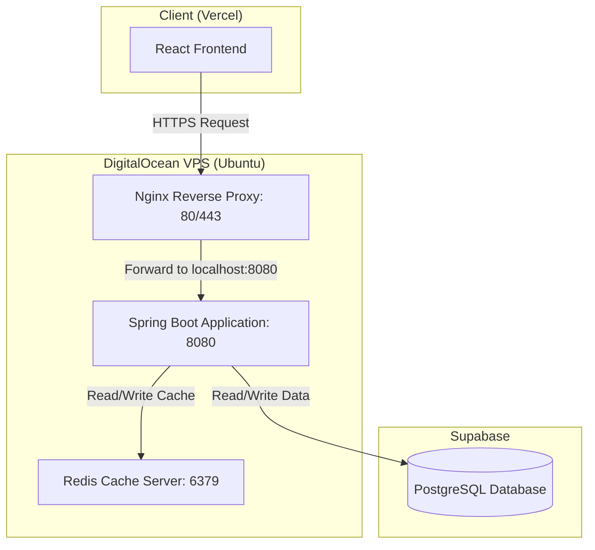

# DigitalOcean VPS Deployment Plan: Spring Boot Backend & Redis

This document provides a production-hardened execution guide to migrate the Spring Boot backend (`rxone-backend`) from Render to a DigitalOcean VPS (Ubuntu 22.04/24.04), while keeping the PostgreSQL database on Supabase and the React frontend on Vercel.

---

## 1. Architecture Blueprint



---

## 2. Phase 1: DigitalOcean Droplet Provisioning

1.  **Create Droplet**:
    *   **OS**: Ubuntu 22.04 LTS or 24.04 LTS (x64).
    *   **Size**: Shared CPU Basic Plan (**2GB RAM / 1 vCPU / 50GB SSD**) is required to support the JVM memory footprint, Nginx, and Redis concurrently. This is fully covered by your $200 student credit.
    *   **Region**: Select a region closest to your target audience or closest to the Supabase database region (to minimize network latency).
    *   **Authentication**: Choose **SSH Key** (highly recommended for security) or generate a strong Root Password.
2.  **Point Domain to Droplet**:
    *   In your domain DNS registrar (GoDaddy, Namecheap, Route53, etc.), create an `A Record`:
        *   **Host**: `api` (e.g. `api.yourdomain.com`)
        *   **Value**: `YOUR_DROPLET_IP`

---

## 3. Phase 2: VPS Package & Security Initialization

Log in via SSH:
```bash
ssh root@YOUR_DROPLET_IP
```

Run the following commands to update and configure basic security:

### 1. System Update & OpenJDK 21
```bash
sudo apt update && sudo apt upgrade -y
sudo apt install openjdk-21-jdk -y
# Verify installation
java -version
```

### 2. Configure UFW Firewall
Restrict access only to public web ports and OpenSSH:
```bash
sudo ufw allow OpenSSH
sudo ufw allow 80
sudo ufw allow 443
sudo ufw enable
# Confirm status
sudo ufw status
```

### 3. Create Dedicated Linux User
Never run Spring Boot application processes as `root`. Create a dedicated system user:
```bash
sudo adduser --system --group --no-create-home rxone
```

### 4. Install Nginx & Certbot
```bash
sudo apt install nginx certbot python3-certbot-nginx -y
```

### 5. Install & Secure Redis Server
```bash
sudo apt install redis-server -y
```
Secure the Redis server instance:
1.  Open the configuration file:
    ```bash
    sudo nano /etc/redis/redis.conf
    ```
2.  Ensure Redis is configured to listen *only* to local loopback interface:
    ```conf
    bind 127.0.0.1 ::1
    ```
3.  Enable a strong access password:
    ```conf
    requirepass YOUR_STRONG_REDIS_PASSWORD
    ```
4.  Restart and enable on boot:
    ```bash
    sudo systemctl restart redis-server
    sudo systemctl enable redis-server
    ```

---

## 4. Phase 3: Environment Configuration & Building

### 1. Environment Secrets Setup (VPS)
Create a secure directory and file to store configuration secrets so they are not hardcoded in the systemd service file:
```bash
sudo mkdir -p /etc/rxone
sudo nano /etc/rxone/rxone.env
```
Populate `/etc/rxone/rxone.env` with your production parameters:
```env
SPRING_PROFILES_ACTIVE=prod
SPRING_DATASOURCE_URL=jdbc:postgresql://YOUR_SUPABASE_HOST:5432/postgres
SPRING_DATASOURCE_USERNAME=postgres.YOUR_PROJECT_ID
SPRING_DATASOURCE_PASSWORD=YOUR_SUPABASE_PASSWORD
SPRING_DATA_REDIS_HOST=127.0.0.1
SPRING_DATA_REDIS_PORT=6379
SPRING_DATA_REDIS_PASSWORD=YOUR_STRONG_REDIS_PASSWORD
SERVER_PORT=8080
# Add Sentry, JWT Secrets, or S3 configurations here:
JWT_SECRET=YOUR_SECURE_JWT_SECRET
```
Restrict file permissions so only `rxone` user and administrators can read it:
```bash
sudo chown -R root:rxone /etc/rxone
sudo chmod 640 /etc/rxone/rxone.env
```

### 2. Package local project (Local Machine)
In your local backend directory (`C:\Users\AjayPawar\Desktop\code\rxone-backend\rxone`), build the fat JAR:
```bash
.\mvnw.cmd clean package -DskipTests
```
This generates a runnable jar file under the target folder: `target/rxone-0.0.1-SNAPSHOT.jar`.

### 3. Transfer JAR to VPS
Upload the file to the VPS `/var/www/rxone/` directory:
```bash
# Create directory on VPS first and configure permissions:
ssh root@YOUR_DROPLET_IP "mkdir -p /var/www/rxone && chown -R rxone:rxone /var/www/rxone"
    
# Upload local JAR:
scp target/rxone-0.0.1-SNAPSHOT.jar root@YOUR_DROPLET_IP:/var/www/rxone/rxone.jar

# Re-enforce permissions
ssh root@YOUR_DROPLET_IP "chown rxone:rxone /var/www/rxone/rxone.jar && chmod 500 /var/www/rxone/rxone.jar"
```

---

## 5. Phase 4: Systemd Service Configuration

To run the Spring Boot application securely as a background service under the dedicated `rxone` user, configure a systemd daemon.

1.  **Create Service File**:
    ```bash
    sudo nano /etc/systemd/system/rxone.service
    ```
2.  **Add Service Configuration**:
    Insert the following service block, ensuring JVM heap bounds are set to protect server memory:
    ```ini
    [Unit]
    Description=RxOne Spring Boot Backend Service
    After=syslog.target network.target redis-server.service

    [Service]
    User=rxone
    Group=rxone
    WorkingDirectory=/var/www/rxone
    ExecStart=/usr/bin/java -Xms512m -Xmx1024m -jar /var/www/rxone/rxone.jar
    SuccessExitStatus=143
    Restart=always
    RestartSec=10

    # Load environment variables from secure env file
    EnvironmentFile=/etc/rxone/rxone.env

    [Install]
    WantedBy=multi-user.target
    ```
3.  **Start and Enable Service**:
    ```bash
    sudo systemctl daemon-reload
    sudo systemctl start rxone.service
    sudo systemctl enable rxone.service
    
    # Check status
    sudo systemctl status rxone.service
    ```

---

## 6. Phase 5: Nginx Reverse Proxy & SSL Setup

1.  **Configure Nginx Server Block**:
    Create a new site configuration:
    ```bash
    sudo nano /etc/nginx/sites-available/api.yourdomain.com
    ```
    Paste the following server block:
    ```nginx
    server {
        listen 80;
        server_name api.yourdomain.com; # Replace with your subdomain

        location / {
            proxy_pass http://127.0.0.1:8080;
            proxy_set_header Host $host;
            proxy_set_header X-Real-IP $remote_addr;
            proxy_set_header X-Forwarded-For $proxy_add_x_forwarded_for;
            proxy_set_header X-Forwarded-Proto $scheme;
            
            proxy_http_version 1.1;
            proxy_set_header Connection "";
        }
    }
    ```
2.  **Enable Configuration**:
    ```bash
    sudo ln -s /etc/nginx/sites-available/api.yourdomain.com /etc/nginx/sites-enabled/
    sudo nginx -t
    sudo systemctl restart nginx
    ```
3.  **Obtain SSL Certificate (HTTPS)**:
    Run Certbot to request a free Let's Encrypt SSL certificate and automatically update Nginx settings:
    ```bash
    sudo certbot --nginx -d api.yourdomain.com
    ```
    Select option to **Redirect all HTTP traffic to HTTPS**.

---

## 7. Phase 6: Frontend Configuration (Vercel)

1.  **Update Environment variables**:
    In your Vercel project settings, update your backend base URL variable (e.g. `VITE_API_BASE_URL`) to point to the new domain:
    `https://api.yourdomain.com`
2.  **Redeploy**:
    Trigger a redeploy of the Vercel frontend.

---

## 8. Verification & Diagnostics

*   **Spring Boot Console Logs**:
    ```bash
    journalctl -u rxone.service -f -n 100
    ```
*   **Nginx Error Logs**:
    ```bash
    tail -f /var/log/nginx/error.log
    ```
*   **Redis CLI Monitor**:
    ```bash
    redis-cli -a YOUR_STRONG_REDIS_PASSWORD monitor
    ```
