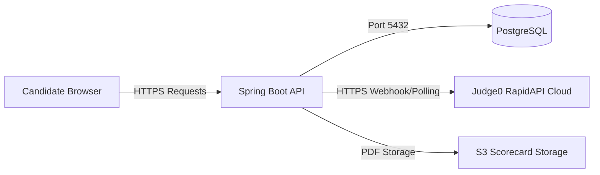

# RxOne MVP Deployment & Assessment Report — Backend (Server-Side)

This report details the readiness, specifications, limitations, rate limits, optimizations, and connection/dependency details for deploying the RxOne Spring Boot backend (`rxone`) to a live production environment.

---

## 1. Executive Summary & Production Readiness
The backend architecture is built using a modern stack (Spring Boot, Java 21, Virtual Threads, Flyway, and PostgreSQL). It handles candidate test snapshotted exams, code execution queues, and proctoring telemetry.

* **Status:** **NOT READY FOR PRODUCTION** (Blocker issues including hardcoded secrets, localhost callback URL configuration, and low database pool size must be resolved first).

---

## 2. Core Backend Features in the MVP

### 2.1 Database & Schema Management
* **Database Engine:** PostgreSQL.
* **Migration Orchestration:** Managed strictly through **Flyway migrations** (`spring.flyway.enabled=true`, Hibernate set to `ddl-auto=validate`).
* **Concurrency Protection:** Optimistic locking via JPA `@Version` column prevents exam data race conditions during simultaneous answers.
* **Performance Indexes:** Migration `V18__add_fk_indexes.sql` establishes foreign key indexes to optimize candidate session list operations.

### 2.2 Compilation & Grading Engine
* **Compiler Engine:** Judge0 CE (hosted via RapidAPI public cloud).
* **Execution Flow:**
  - Fast Code Run (`POST /api/code/execute/run`): Compiles code against public sample cases.
  - Asynchronous Code Submission (`POST /api/code/execute/submit`): Queues code, returns a token, and grades all private test cases.
* **Async Polling Fallback:** `Judge0PollingService` is a scheduled cron (runs every 10 seconds) that picks up uncompleted submissions to ensure grading completes even if webhooks fail.

### 2.3 Resiliency & Metrics
* **Concurrency Tuning:** Virtual Threads are enabled (`spring.threads.virtual.enabled=true`) to optimize high-volume I/O operations.
* **Circuit Breaker:** Resilience4j gates Judge0 API calls (`resilience4j.circuitbreaker.instances.judge0`) to prevent service exhaustion if Judge0 goes offline.
* **Observability:** Spring Actuator exposes `/actuator/health`, `/actuator/info`, and `/actuator/metrics`.

---

## 3. Critical Gaps & Required Additions (Blockers for Live Launch)

### 3.1 Hardcoded Secrets & Configurations (CRITICAL — P0)
* **Vulnerability:** JWT secret (`app.jwt.secret`), database password (`spring.datasource.password`), and RapidAPI key (`judge0.api.key`) have hardcoded defaults in `application.properties`.
* **Fix:** Remove the default values. Force startup failure if `JWT_SECRET`, `DB_PASSWORD`, `DB_USERNAME`, or `JUDGE0_API_KEY` environment variables are missing.

### 3.2 Judge0 Callback URL Config (CRITICAL — P0)
* **Issue:** `judge0.callback.url` is set to `http://localhost:8081/api/code/execute/callback`. When deployed to live, the Judge0 API cloud cannot reach `localhost`.
* **Fix:** Update this property in the production environment variables to match the public production backend API URL (e.g. `https://api.rxone.com/api/code/execute/callback`).

### 3.3 Database Connection Pool Size (HIGH — P1)
* **Issue:** Hikari CP maximum pool size is set to `maximum-pool-size=4` in `application.properties`. Under high concurrent exam load, this will cause thread starvation and backend database timeouts.
* **Fix:** Set the live connection pool to a production-ready value:
  ```properties
  spring.datasource.hikari.maximum-pool-size=${DB_MAX_POOL_SIZE:25}
  spring.datasource.hikari.minimum-idle=${DB_MIN_IDLE:10}
  ```

### 3.4 Immediate Grading Integration (HIGH — P1)
* **Issue (RX-NEW-001):** Submissions remain `PENDING_GRADING` and candidates get no compile feedback because the batch grader only runs after the exam closes.
* **Fix:** Implement immediate grading:
  1. Trigger a `SubmissionCreatedEvent` upon submission save.
  2. Implement an asynchronous `@TransactionalEventListener` (`ImmediateGradingListener`) to immediately trigger `gradeSubmission()`.
  3. Relax the batch grader to act as a fallback safety-net sweep (runs every 20 minutes) for submissions older than 5 minutes.

### 3.5 Optimistic Lock Conflict Retrying (HIGH — P1)
* **Issue (RX-061):** If two concurrent requests try to update the same record, it returns HTTP 409 Conflict with no server-side retry.
* **Fix:** Implement Spring AOP `@Retryable` or manual retry loop in the service layer to handle optimistic locking conflicts gracefully.

---

## 4. Backend Rate Limits & Optimizations

### 4.1 Implemented Rate Limits (Bucket4j Filters)
1. **Authentication Limiter (`AuthRateLimitFilter`):**
   - **Routes:** `/auth/login` and `/auth/register`.
   - **Limit:** 5 attempts per minute per IP address.
   - **Status Code:** Returns HTTP `429 Too Many Requests` with a `Retry-After: 60` header.
2. **Code Execution Limiter (`CodeExecutionRateLimitFilter`):**
   - **Routes:** `/api/code/execute/run` and `/api/code/execute/submit`.
   - **Limit:** 10 requests per minute per candidate session (keys by `email:sessionId`).

### 4.2 Optimizations
* **API Compression:** GZIP compression is enabled for payloads larger than 1024 bytes (`server.compression.enabled=true`).
* **Batch Inserts:** Hibernate JDBC batch inserts are enabled (`spring.jpa.properties.hibernate.jdbc.batch_size=500`).

---

## 5. Connections & Dependencies

### 5.1 Connection Integration Diagram


### 5.2 Key Dependencies
* **Core:** Spring Boot 4.0.6 (or Spring Boot 3.x Starter packages), Java 21.
* **Database:** PostgreSQL Driver, Flyway Core, HikariCP.
* **Security & Auth:** Spring Security, `jjwt-api` & `jjwt-impl` (v0.11.5).
* **Rate Limiting:** `bucket4j-core` (v8.10.1).
* **Resiliency:** `resilience4j-spring-boot3` (v2.2.0), Spring Boot AOP.
* **Report Utilities:** `openpdf` (v2.0.3) for generating candidate PDFs; `poi-ooxml` (v5.4.0) for spreadsheets.
