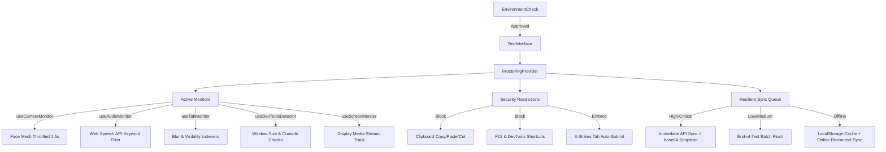

# Secure Proctoring Engine Developer Guide

This module provides a production-grade, resource-optimized, client-side proctoring and anti-cheating suite. It coordinates camera, microphone, screen, and browser behavior analysis, while prioritizing low CPU usage and minimal AWS cost overhead.

---

## Folder & File Structure Directory

Below is the layout of the `src/proctoring/` folder:

| Path | Description |
| :--- | :--- |
| `ProctoringProvider.tsx` | Main React Context Provider managing orchestration, state, base64 visual proof captures, and reconnect triggers. |
| `hooks/useCameraMonitor.ts` | Tracks face count (detects Look Away & Multi-Face) using a resource-friendly 1.5s throttled loop. |
| `hooks/useAudioMonitor.ts` | Local Web Speech API keyword filter. Falls back to a throttled 300ms volume check on unsupported browsers. |
| `hooks/useTabMonitor.ts` | Monitors window focus, visibility, and fullscreen changes with a 5-second initial grace period. |
| `hooks/useDevToolsDetector.ts` | Caches size gaps between inner and outer window width/height to identify open DevTools panels. |
| `hooks/useScreenMonitor.ts` | Orchestrates mandatory candidate screen sharing via `getDisplayMedia`. |
| `components/EnvironmentCheck.tsx` | Pre-test diagnostic checker ensuring camera, microphone, and fullscreen permissions are active. |
| `components/CameraPreview.tsx` | Minimizable, floating candidate webcam video feed with trust score border styling. |
| `components/ViolationToast.tsx` | Renders animated popup toast notifications to warn candidates when violations occur. |
| `ai/objectDetector.ts` | Local TensorFlow COCO-SSD pipeline scanning video stream for devices, books, or phones. |
| `ai/llmDetector.ts` | Client-side Xenova Transformers classifier to run sequence pattern checks on violations. |
| `storage/violationStorage.ts` | Handles local persistence (`localStorage`), immediate/deferred HTTP sync routes, and unsynced logs queue. |

---

## Architecture Overview



---

## 1. Context Provider (`ProctoringProvider.tsx`)

The `ProctoringProvider` maintains proctoring states, registers the active monitor hooks, and exposes sync actions.

### Context State & API
```typescript
interface ProctoringContextType {
  violations: Violation[];
  trustScore: number;
  isProctoringActive: boolean;
  cameraActive: boolean;
  micActive: boolean;
  videoRef: React.RefObject<HTMLVideoElement | null>;
  addViolation: (type: ViolationType, metadata?: Record<string, unknown>) => void;
  startProctoring: () => void;
  stopProctoring: () => void;
  syncViolations: () => Promise<boolean>;
}
```

---

## 2. Onboarding Wizard (`EnvironmentCheck.tsx`)

Forces diagnostics checks before test access is granted.
- **Verification checks**: Verifies webcam hardware presence, mic hardware presence, browser APIs compatibility, and fullscreen status.
- **Enforcement**: Blocks rendering of the test content until the candidate successfully passes all permissions and enables fullscreen.

---

## 3. Active Resource-Throttled Monitors (Hooks)

### `useCameraMonitor.ts` (Face Estimation)
- **Throttling**: Instead of running estimation at `requestAnimationFrame` speed (~60fps), it runs via a recursive `setTimeout` loop capped at once every **1.5 seconds**.
- **Violations**: Triggers `LOOK_AWAY` if faces in frame === 0, or `MULTI_FACE` if faces in frame > 1.

### `useAudioMonitor.ts` (Keyword Speech-to-Text)
- **Noise Filtering**: Uses the browser's native **Web Speech API** (`webkitSpeechRecognition` / `SpeechRecognition`) to transcribe speech locally.
- **Keyword Classifier**: Checks transcription against a list of suspicious words (e.g. `google`, `search`, `answer`, `help`, `options`, `question`, `share screen`, etc.). Unrelated noises (barking dogs, rotating fans, family calls) are ignored to eliminate false positives.
- **Fallback**: Automatically falls back to a throttled 300ms volume tracker if Speech Recognition is unsupported on the client's browser.

### `useTabMonitor.ts` (Focus Tracking)
- Direct event listener targeting browser `visibilitychange`, window `blur`, and fullscreen exits.
- Employs a **5-second grace period** from initialization (to prevent screen share popup triggers from flagging immediate violations) and a **300ms debounce** on blur.

### `useDevToolsDetector.ts` (Console Checking)
- Evaluates `window.outerWidth - window.innerWidth` and `window.outerHeight - window.innerHeight` every 2 seconds. A delta greater than `160px` triggers `DEVTOOLS_OPEN`.

### `useScreenMonitor.ts` (Screen Capture)
- Triggers browser `getDisplayMedia` to prompt the candidate to share their screen.
- Listens to the video track's `onended` event to flag a `SCREEN_RECORD` violation if the candidate stops screen sharing during the test.

---

## 4. Security Restrictions & Enforcement

### Clipboard & Keyboard Blockers
Mounted globally as capturing listeners inside `TestInterface.tsx`:
- Disables right-clicks context menu.
- Disables copy, paste, and cut actions.
- Disables developer tools shortcuts (`F12`, `Ctrl+Shift+I`, `Ctrl+Shift+J`, `Cmd+Opt+I`).
- Listens to `PrintScreen` keyup events, wipes the keyboard clipboard using `navigator.clipboard.writeText("")`, and surfaces warning alerts.

### Hard "3-Strikes" Tab Switch Policy
- Tracks the number of `TAB_SWITCH` or `EXTENDED_TAB_SWITCH` entries.
- Switch 1 & 2 trigger warning overlays showing `Count / 3`.
- The 3rd tab switch triggers an immediate auto-submission of the exam (`submitTest()`).

---

## 5. Visual UI Components

### `CameraPreview.tsx`
- Renders the live webcam stream in a floating draggable box at a chosen screen corner.
- Border colors update dynamically according to the `trustScore` (green for `> 80%`, orange for `50% - 80%`, red for `< 50%`).
- Can be collapsed/minimized to save screen space.

### `ViolationToast.tsx`
- Subscribes to the violation history stream and manages a queue of the last 3 active warnings.
- Dismisses toasts automatically after 6 seconds using framer-motion animations.

---

## 6. Local AI & Machine Learning Detection

### `objectDetector.ts`
- Uses the TensorFlow **COCO-SSD** model loaded locally in the client browser.
- Runs every 5 seconds, filtering detections with confidence scores `> 0.4` for suspicious objects (e.g. `cell phone`, `book`, `laptop`, `tablet`, `remote`, `calculator`).

### `llmDetector.ts`
- Uses Xenova's `@xenova/transformers` to run the lightweight `Xenova/distilbert-base-uncased-finetuned-sst-2-english` model client-side.
- Analyzes sequences of actions to classify abnormal behaviors.

---

## 7. Offline Queue & low-cost AWS Syncing

### Grayscale Canvas Frame Capture
- For `HIGH` or `CRITICAL` violations, a canvas frame is drawn from the webcam preview.
- Grayscale filters are applied (reducing base64 size by **~66%**).
- Exported as a 60% quality compressed JPEG string (`~3KB`), which is attached to the violation payload as the `evidence` field.

### Tiered Network Syncing
- **Immediate Alerts**: Critical/High violations (e.g. devtools opening, tab switches) are POSTed to the backend immediately.
- **Deferred Batching**: Low/Medium warnings are queued locally and uploaded in a single bulk batch request right before final session submission.
- **Network Outage Resilience**: Sync calls track status locally using `synced: boolean`. If a network connection is lost, violations are cached. A window `online` reconnect listener automatically flushes all pending logs to `/api/test-sessions/:id/violations/batch` when connectivity is recovered.
